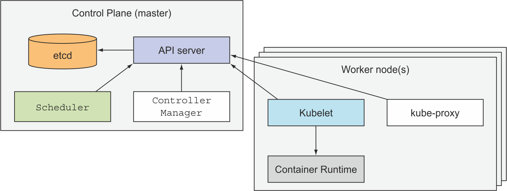

# Kubernetes in Actions

## Table of Contents
- [Chapter 1 - Introducing Kubernetes](#chapter-1---introducing-kubernetes)


## Chapter 1 - Introducing Kubernetes
Monolithic applications consist of components that are tightly coupled together and have to be developed, deployed, and managed as one entity, because they all run as a single os process. Monolithic applications have many problems that are addressed by microservices, smaller independently deployable components that runs as independent processes. Microservices interact with each other through a well-defined APIs. The protocols used by microservices usually are REST and AMQP (Advanced Message Queueing Protocol, that is asynchronous). All the protocols are not tied to a particular programming language.

When deploying them, someone or something needs to configure all of them properly to enable them to work together as a single system. The divergence of dependencies between application components, where applications require different versions of the same libraries, is inevitable.

### DevOps and NoOps
DevOps is the practice to create the application, develop it, tended it and kept it running and taking care to its whole lifetime. 

NoOps is the practice or the idealistic scenario in which the developers deploy the application themselves, without knowing anything about the hardware infrastructure and without dealing with the operation team, responsible of production deployments and the infrastructure the application runs.

### Container Introduction
When an application is composed of only smaller numbers of large components, it’s completely acceptable to give a dedicated Virtual Machine (VM) to each component and isolate their environments by providing each of them with their own operating system instance.

A container, on the other hand, is nothing more than a single isolated process running in the host OS, consuming only the resources that the app consumes and without the overhead of any additional processes.
A process running in a container runs inside the host’s operating system, like all the other processes (unlike VMs, where processes run in separate operating systems). But the process in the container is still isolated from other processes.

When using containers, you can (and should) have *one container for each application*.

Underneath those VMs is the host’s OS and a hypervisor, which divides the physical hardware resources into smaller sets of virtual resources that can be used by the operating system inside each VM. Applications running inside those VMs perform system calls to the guest OS’ kernel in the VM, and the kernel then performs x86 instructions on the host’s physical CPU through the hypervisor. Containers, on the other hand, all perform system calls on the exact same kernel running in the host OS. This single kernel is the only one performing x86 instructions on the host’s CPU. The CPU doesn’t need to do any kind of virtualization the way it does with VMs. To run a container, nothing needs to be booted up, as is the case in VMs. A process run in a container starts up immediately.

### How to make Container Isolation
To make isolation possible are used two mechanisms, available in Linux os:
- `linux namespaces`: make sure each oricess sees its own personal view of the system (e.g. files, processes, network interfaces)
- `linux control groups`, or `cgroups`: limit the amount of resources the process can consume (e.g. CPU, memory, network bandwidth)

#### Isolating processes with Linux namespaces
By default, each Linux system initially has one single namespace. All system resources, such as filesystems, process IDs, user IDs, network interfaces, belong to the single namespace.

Linux allows to create additional namespaces and organize resources across them. When running a process, you run it inside one of those namespaces. The process will only see resources that are inside the same namespace.

Multiple kind of namespaces exist, so a process doesn't belong to one namespace, but to one namespace of each kind.

The following kinds of namespaces exist:
- Mount, `mnt`
- Process ID, `pid`
- Network, `net`
- Inter-process communication, `ipc`
- UTS
- User ID, `user`

Each namespace kind is used to isolate a certain group of resources.

The UTS namespace determines what hostname and domain name the process running inside that namespace sees. By assigning two different UTS namespaces to a pair of processes, you can make them see different local hostnames. In this way, as far as the hostname is concerned, it will appear these processes are running on a different machine.

The Network namespace establish which network interface a process can see, because each network interface belongs to one and only one linux namespace. In this way, we can make a container sees only its own network interfaces. 

#### Limiting the resources available to a process
The other half of isolation deals with limiting the amount of resources a container can consume. Linux allows to achieve this with `cgroups`, a linux kernel feature that limits the resources a process, or a group of processes, can use. 

### Docker 
Container technologies have been around for a long time when Docker came out. It was revolutionary because is the first container system that made containers easily portable across differente machines. It simplifies the process of packaging up not only the application but also all its libraries and other dependencies, even the whole operating system file system, into a simple, portable package that can be used to provision the application to any other machine running
Docker.

When you run an application with Docker, it sees the exact filesystem contents that you've bundled with it and nothing else about the server it's running on.

### Docker Concepts
Docker is a platform for packing, distributing, and running applications. It allows to package the application with its whole environment (e.g. libraries)

- **images**: a docker based cointainer image is something we can package the application and its environment into. It contains the filesystem that will be available to the application and other metadata
- **registries**: a docker registry is a repository that stores docker images. We can `push` or `pull` images from it. Registries can be public (e.g. Docker Hub) or private.
- **containers**: a docker container is a regular Linux container created from a docker image. A **running container** is a process running on the host running Docker, with a fixed amount of resources available.

Docker images are composed of layers, and two images can contain the same layers because every Docker image is built on top of another image. Container images layers are read-only. When container is run, a new writable layer is created on top of the layers in the image. When the process in the container writes to a file located in one of the underlying layers, a copy of the whole file is created in the top-most layer and the process writes to the copy. 

### Portability Limitations of container images
Not every container image can run on any Linux machine running Docker. Indeed, some containerized applications require a specific kernel version. VMs do not have such constraints, because each VM runs its own kernel.

Moreover, a containerized application can be built for a specific hardware architecture. We cannot containerize an application built for the x86 architecture and expect it to run on an ARM-based machine.

### Rock It
Rock-it, or `rkt`, is another Linux container engine. It is a platform for running containers, as Docker. It puts a strong emphasison security, composability, and conforming to open standards. It uses the OCI container image format and can even run regular Docker container images.

Kubernetes support rkt as a container runtime.

### Kubernetes
Kubernetes is a software system that allows to easily deploy and manage containerized applications on top of it. It relies on the features of Linux containers to run heterogeneous applications without having to manually deploy these applications on each host. 

A kubernetes system is composed of a master node and any number of worker nodes. When the developer submits a list of apps to the master, kubernetes deploys them to the cluster of worker nodes.

#### Kubernetes Architecture
Two types of nodes
- **master node**: it hosts the **kubernetes control plane** that controls and manages the whole kubernetes system
- **worker node**: run the deployed applications

The **control plane** is what controls the cluster and makes it function. It consists of multiple components that can run on a single master node or be split across multiple nodes and replicated to ensure high availability. These components are:
- the **kubernetes API server**, which we and the other control plane components communicate with
- the **Scheduler**, which schedules apps assigning a worker node to each deployable component of the application
- the **Controller Manager**, which performs cluster-level functions (e.g. replicating components, keeping track of worker nodes, handling node failures)
- **etcd**, a reliable distributed data store that persistently stores the cluster configuration

The components of the Control Plan hold and control the state fo the cluster.

The worker nodes are the machines that run containerized applications. The task of running, monitoring, and providing services to applications is done by the following components:
- docker, or another *container runtime*
- the **kubelet**, which talks to the API server and manages containers on its node
- the **Kubernetes Service Proxy**, or *kube-proxy*, which load balances network traffic between application components



#### Running an application in Kubernetes
To run an application in Kubernetes, you first need to package it up into one or more container images, push those images to an image registry, and then post a description of your app to the Kubernetes API server.

The description includes information such as the container image or images that contain your application components, how those components are related to each other, and which ones need to be run co-located (together on the same node) and which don’t. For each component, you can also specify how many copies (or replicas) you want to run. Additionally, the description also includes which of those components provide a service to either internal or external clients and should be exposed through a single IP address and made discoverable to the other components.

When the API server processes your app’s description, the Scheduler schedules the specified groups of containers onto the available worker nodes based on computational resources required by each group and the unallocated resources on each node at that moment. The Kubelet on those nodes then instructs the Container Runtime (Docker, for example) to pull the required container images and run the containers. After submitting the descriptor to Kubernetes, it will schedule the specified number of replicas of each pod to the available worker nodes. The Kubelets on the nodes will then tell Docker to pull the container images from the image registry and run the containers.

# First Steps with Docker and Kubernetes

Common docker commands

```bash 
$ docker images
$ docker ps
$ docker rmi image_id
```


## Run an image
Use `docker run` command and specify what image to download and run and (optionally) what command to execute. Docker checked to see if the `busybox:latest` image is already present on the local machine. If it does not, docker downloads the image. 

Docker supports having multiple versions or variants of the same image under the same name. Each variant must have a unique tag. When referring to images without explicitly specifying the tag, Docker assumes we are reffering to the `latest` tag.

```bash
$ docker run <image>
$ docker run busybox echo "Hello world!"
```

## Create an image
To package an app to an image we have to create the `Dockerfile`, which contains a list of instructions that Docker performs when building the image. 

By default, The Dockerfile needs to be in the same directory of the source code.

In the following
- the `FROM` defines the **base image**
- the `ADD` we add `app.js` file into the root directory of the image
- the `ENTRYPOINT` we define the command that will be executed when the image is run

``` docker
FROM       node:7
ADD        app.js /app.js
ENTRYPOINT ["node", "app.js"]
```

## Build an image

The build process isn't performed by the Docker client. The contents of the whole directory are uploaded to the Docker daemon and the image is built there. The client and the daemon don't need to be on the same machine.
If we're using Docker on a non-Linux OS, the client is on our host OS, but the daemon runs inside a VM, because all the files are uploaded to the daemon.

We could build the images manually bu running a container from an existing image, executing commands in the container, exiting the container, and committing the final state as a new image. This is exactly what happens when we build from a Dockerfile.

``` bash 
$ docker build --tag nodeserver:2.0 .
```


## Run an image
If we're not running the Docker daemon on your local machine we'll need to use the hostname or IP of the VM running the daemon instead of localhost (e.g to perform `curl` requests to see if the container is up). We can look it up through the `DOCKER_HOST` environment variable.


```bash
$ docker run --name kubia-container -p 8080:8080 --detach kubia
$ docker inspect kubia-container
$ docker exec -it kubia-container bash
```

Th`-i` option is to keep `stdin` open, `-t` is to allocate a pseudo terminal (TTY). We need both because without the first we can not type any command, if we leave out the second the command prompt won't be displayed and some commands will complain about the `TERM` variable not being set.

## Stop Container 
To stop and remove a container

```bash
$ docker stop kubia-container
$ docker rm   kubia-container
```


## Minikube
Minikube is a tool that sets up a single-node cluster that is great for both testing kubernetes and developing apps locally.

```bash
$ minikube start
$ minikube stop
```

## Kubectl
Kubectl is a CLI client that allows to interact with kubernetes clusters. It issues REST requests to the Kubernetes API server running on the master node.

The `kubectl get` can list all kinds of kubernetes objects

```bash
$ kubectl cluster-info              # get information about cluster
$ kubectl get nodes
$ kubectl describe node node-name
```


### tab completion
To enable tab completation in bash, we have to install `bash-completion` package and then run 

```bash
$ source < (kubectl completion bash)
```

add it also in `~/.bashrc`


### How to run an app on cluster
The images are pulled from a docker repository (by default DockerHub). We can do it in many ways, where the manual one is

```bash
$ kubectl run kubia --image=palmisanomassimo/kubia --port 8080 --generator=run/v1
```

where the `--generator` flag is to make kubernetes creating a replication controller instead of a deployment.

With the previous command, kubernetes created a new replication controller object in the cluster by sending a REST http request to the Kubernetes API server. The replication controller then created a new pod, which was then scheduled to one of the worker nodes by the Scheduler. The kubelet on that node saw that the pod was scheduled to it and instructed Docker to pull the specified image from the registry because the image wasn't available locally. After downloading the image, Docker created and ran the container.

NOTE: with **scheduling** means assigning the pod to a node


## Pods
A pod is a group of one or more tightly related containers that will always run togheter on the same worker node and in the same Linux namespace(s). Each pod is like a separate logical machine with is own IP, hostname, processes and so on, running a single application.

To see all running pods run `kubectl get pods`. 

The `kubectl describe pod pod-name` is to get more information about a pod but is also useful when the pod stays stuck in the `pending` status.

```bash
$ kubectl get po
$ kubectl get pods

$ kubectl describe pod pod_name

$ kubectl delete pod pod_name
```


