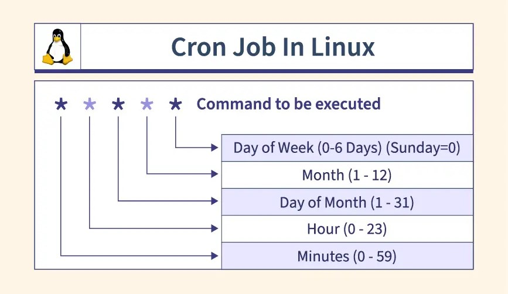

# Linux CheatSheet

Notes of linux udemy course. The linux distribution used is CentOS

## System Access and File System
There are seven different types of files:
- `d` -> directory
- `l` -> link
- `c` -> special file or device file
- `s` -> socket
- `p` -> named pipe
- `b` -> block device

The `/etc/` directory contains all configuration files

# Base commands

The `ls` command is used to list files and directories sharing the same path.

- `l` option for long format
- `a` option to show hidden files
- `r` option to reverse order
- `d` option to show directories
- `t` option to sort by modification time
``` bash 
$ ls -d   # shows only the directories
$ ls -ltr # sorts the list of files and directories by modification time
```

Other fundamentals commands
``` bash 
$ pwd    # print working directory
$ whoami # print effective user id
$
```


To change user password just run `passwd user_id`

### Find and Locate commands
The commands `find` and `locate` are used to find files and directories in the filesystem. 
The `locate` command uses a prebuilt database, which should be regularly updated; while find iterates over a filesystem to locate files. Thus, `locate` is much faster than `find`, but can be inaccurate if the database is not updated. 

If the command does not output any result:

``` bash
$ updatedb                # run as root
$ rmp -qa | grep mlocate  # check if the package mlocalte is installed on the system
```

The syntax is

``` bash
$ find relative/path -name "file_name"
$ locate "file_name"
```

### Wildcards
A wildcard is a character that can be used as a substitute for any of a class of characters in a search

```
*  - represents zero or more characters
?  - represents a single character
[] - represents a range of characters
\  - escape character
^  - the beginning of the line
$  - the end of the line
```

We can use wildcards for instance to create a lot of directories

``` bash 
$ ls -l ?bcd*              # it lists all files that has as second, thid and fourth letters "bcd"
$ ls -l *[de]*             # list all files or directories that has a 'd' or 'e'
$ touch abcd{1..9}-xyz.txt # it creates 9 files abcd1-xyz.txt ... abcd1-xyz.txt
$ rm abc*                  # rm all files that start with "abc
```

### Soft and Hard Links
An inode is a pointer or number of a file on the hard disk. Everytime a file is created, the operating system assign a number to that file, aka inode. To show the inodes of files run `ls -li`, where the `i` option stands for inode.

A soft link is a link that will be removed if the file is removed or renamed. The soft link has a different inode of the file.

An hard link is a link that is not affected if the origin file is renamed or removed. Since hard link and the file points to the content directly, they have the same inode.
If we get the error "invalid cross-device link" while creating an hard link is most likely because the link and the file are not in the same partition. Indeed, hard links only work within the same partition.

It is not possible to create soft and hard link within the same directory with the same name.

``` bash
$ ln    file hard_link    # creates an hard link pointing to the same content of file
$ ln -s file soft_link    # creates a  soft link pointing to the file
```

## Linux Fundamentals

### Secure Shell Protocol
The secure shell - ssh is a protocol that allows to connect to communicate securely over the network. 

Three authentication methods:
- username and password
- public and private key
- host

The basic syntax is 

``` bash 
$ ssh username@server_ip
$ ssh -l username server_ip
```

it uses the first authentication method and the password will be asked.

To generate ssh keys run

``` bash 
$ ssh-keygen
$ ssh-keygen -t rsa # interactive rsa keys generation
```

The SSH agent is a background process that manages ssh keys. To add a private key to the agent, run

``` bash 
$ ssh-agent                   # start ssh agent
$ ssh-add path/to/private_key # add a private key to the agent
$ ssh-add -l                  # lists the keys currently loaded in the agent
$ ssh-add -D                  # removes all the keys from the agent
```

We can use ssh to copy files from the client to the server

``` bash 
$ scp file/to/copy username@server_ip destination/path
```

To get ip address in windows

```cmd
> ipconfig
```

in Linux

```bash
$ ifconfig
$ hostname -I
```
run `ipconfig` on windows and `ifconfig` on linux. Alternatively, just run 

### File permissions
To change the permissions of a file or a directory we use the `chmod` command

``` bash 
$ chmod u+x file # assigns executable permissions to file for the current user
$ chmod g-r directory # remove read permissions to the group of the user
$ chmod a-w directory # remove write permissions to everyone
```

the syntax is `chmod [aoug][+|-][rwx] [file | directory]`. Executable permissions for a directory means to enter such directory.

### File ownership commands
A file or directory belong to a user and a group. If a file belongs to a group, a user inherit those permissions if he belongs to that group.
We use `chown` to change the user ownership and `chgrp` to change the group ownership of the file or directory. 
Only root has the permissions to change the ownership.

``` bash 
$ chown root seinfeld-characters # assign the ownership of the file to root
$ chown mpalmisano folder/       # assign the ownership of the directory to mpalmisano recursively
```

Note: if a file owned by the user A is in a directory owned by the user B, B can delete it even if the file itself does not give the permissions to everyone.

### Access Contol List
The ACL - Access Control List provides an additional, more flexible permission mechanism for file systems. It allows to give permissions for any user or group to any disc resource. The commands to remove and assign permissions are `setfacl` and `getfacl`

``` bash
$ setfacl -m u:username:rwx /path/to/file  # add permissions to a user. -m stands for modify
$ setfacl -m g:groupname:rwx /path/to/file # add permissions to a specific group
$ setfacl -x u:username /path/to/file      # remove a specific entry for a specific user
$ setfacl -b path/to/file                  # remove all permissions for all users
$ getfacl path/to/file                     # get acl of a file
```

when we assign the ACL permission to a file or directory the os adds a `+` sign at the end of the permission.
setting `w` permission with ACL does not allow to remove a file

### Get command info
To get information about how to use a command, depending on how much details we want, linux offers three commands

``` bash
$ whatis command # get basic usage
$ command --help # get usage
$ man command    # get detailed usage
```

### Standard Output to a file
If we want both show the result of a command to the stdout and store into a file, we can use the `tee` command

``` bash 
$ echo "awesome text" | tee --append output.txt # or -a
```

### Pipes 
We can use pipes `|` to concatenate the output of a command as input of another command. 

``` bash
$ ls -l | tail -2
```

### File Maintenance Commands
We use the commands `mv`, `cp`, `rm`, `mkdir` and `rmdir` to file maintenance operations

``` bash
$ mv actual_filename new_filename       # rename file
$ mv old/path/file new/path/file        # move a file
$ mv old/path/dir/ new/path/dir/        # move a directory
$
$ cp old/path/to/file /new/path/to/file # copy file
$ cp -r directory_1 new/destination/    # copy directory recursively and its content
$
$ rmdir path/to/dir                     # remove empty directory
$ rm -r path/to/dir                     # remove a directory and its content recursively
$ rm *.txt                              # remove all files that end with .txt 
$
$ mkdir dir                             # creates a directory named dir
$ mkdir -p dir_1/dir_2                  # creates a nested directory 
```

### File display commands
To show file contents we have `cat`, `more`, `less`, `head` and `tail` commands

``` bash 
$ cat     file        # show the file content
$ more    file        # show one page at a time
$ less    file        # show one line at a time
$ head -5 file        # show the first 5 lines of a file
$ tail -5 file        # show the last  5 lines of a file
```

### Text processors commands

The command `cut` is command line utility that allows to cut parts of lines from specified files or piped data and print the results to the stdout. It can be used to cut parts of a line by delimiter, byte position, and character

``` bash
$ cut -c1        file         # get the first character of every line
$ cut -c1,2,4    file         # get the 1st, 2nd and 4th characters of every line
$ cut -c3-5      file         # get the characters from the 3rd to the 5th of every line
$ cut -c2-5,7-9  file         # get the characters from the ranges 2-5 and 7-9 of every line
$ cut -d: -f 6-7 /etc/passwd  # get the 6th and 7th field where the : is the delimiter
```

The `awk` command is a utility/language designed for data extraction. Most of the time it is used to extract fields from a file or from an output.

``` bash
$ awk '{print $1}' text.txt                        # get the first column
$ ls -l | awk '{print $1, $3}'                     # print the 1st and 3rd column
$ ls -l | awk '{print $NF}'                        # print the last column of every line
$ awk '/Jerry/ {print}'                            # print the lines that has the word Jerry 
$ awk -F: '{print $1}' /etc/passwd                 # to set ':' as a delimiter
$ echo "Hello Tom" | awk '{$2="Adam"; print $0}'   # replace the column that maches a specific keyword
$ awk 'length($0) > 15'                            # get the lines that have more than 15 byte size
$ ls -l | awk '{if ($9 == "seinfeld") print $0;}'  # print all the lines that has seinfeld as file name
$ ls -l | awk '{print $NF}'                        # print the number of fields of each line
```

The `grep` command (i.e. global regular expression print) process text line by line and print any lines which match a specified pattern. The command `egrep` is the same as `grep` but it allows to have more than one keyword

``` bash
$ grep Seinfeld seinfeld-characters           # returns the lines where 'Seinfeld' is in it
$ grep -i Seinfeld seinfeld-characters        # to ignore case-sensitive
$ grep -c Seinfeld seinfeld-characters        # returns the number of matches
$ grep -n Seinfeld seinfeld-characters        # indicates the line number of the occurence
$ grep -v Seinfeld seinfeld-characters        # to get the lines that do NOT match the word
$ egrep "Seinfeld|Babes" seinfeld-characters  # to get the lines where is present "Seinfeld" or "Babes"
```

The `sort` command sort lines in alphabetical order, instead `uniq` command filters out the repeated or duplicate lines

``` bash
$ sort     seinfeld-characters  # basic usage
$ sort -r  seinfeld-characters  # sort lines in alphabetical order
$ sort -k2 seinfeld-characters  # sort lines using the 2nd field
$ uniq     seinfeld-characters  # remove duplicates lines
$ uniq -c  seinfeld-characters  # how many times a line occures
$ uniq -d  seinfeld-characters  # shows only the repeated lines
```

The word count `wc` command reads either stdin or a list of files and generates newline count, word count and byte count.

```bash 
$ wc    seinfeld-characters  # gives how many lines, words and bytes has the file
$ wc -l seinfeld-characters  # to get only the numbers of lines
$ wc -w seinfeld-characters  # to get only the numbers of words
$ wc -c seinfeld-characters  # to get only the numbers of bytes
$ ls -l | wc -l              # to get the number of files of the current directory plus 1 
```

### Files comparison

The `diff` command allows to compare two files line by line. The `comp` command allows to compare two files byte by byte

``` bash 
$ diff file_1 file_2
$ cmp file_1 file_2
```

### Files Compression

The `tar` command (a.k.a. tape archive) allows to archive and compress files and directories. The option `-c` is to create a new archive, `-v` to enable the verbose mode and `-f` to allow to specify the archive name. The option `-z` is to use gzip compression.

``` bash 
$ tar -cvf  archive.tar directory/      # compress directory in an archive
$ tar -xvf  archive.tar                 # to extract files from the archive
$ tar -czvf archive.tar.gz directory/   # to create a compressed tar archive
$ tar -xzvf archive.tar.gz              # to extract files from a compressed tar archive
$ tar -rvf  archive.tar.gz              # append files to an existing tar archive
$ tar -tvf  archive.tar                 # to list contents of a tar archive
```

The `gzip` command compress a file and `gzip -d` or `gunzip` commands unzip a file. 

``` bash
$ gzip seinfeld-characters # basic usage
$ gzip file_1 file_2       # compress multiple files
$ gzip archive.tar         # to compress a tar archive
$ gunzip archive.tar.gz    # to uncompress a gzip archive
$ gzip -d archive.tar.gz   # to uncompress a gzip archive
```

### Truncate File Size

The `truncate` command is often used to shrink or extend the size of a file to the specified size. When we increase the size of the file, the os adds a dummy character that does not correspond to the blank space.

``` bash 
$ truncate -s 10 seinfeld-characters # truncate the file to a size of 10 characters
```

### Combining and Splitting files
Multiple files can be combined together into one and vice versa. To split files we use the `split` command

``` bash
cat   file1 file2 file3 > file4 # combine the three files into one
split -l 30 file4 child         # split file4 into chunks of 30 lines into files starting with 'child'
```

## System Administration

### Linux File Editor
A text editor is a program which enables us to create and manipulate textual data in a Linux file. 

Linux provides the following file editors
- **vi**    - visual editor
- **ed**    - standard line editor
- **ex**    - extended line editor
- **emacs** - a full screen editor
- **pico**  - beginner's editor
- **vim**   - advanced vi 


#### Vi - Visual Editor
Vi is available in almost every linux distribution.

The most common keys are
- i     - insert
- r     - replace
- d     - delete
- u     - undo last change
- o     - creates a new line and go into insert mode
- x     - delete a character
- /cat - to search the word cat
- :q!   - quit without saving
- :wq!  - quit and save changes
- esc   - escape out of any mode

To quit and save we can use `^Z^Z`

Create a file and enter the editor

```bash 
$ vi file # enter in the command mode
```

Don't use the arrows to move around in the file while you are in the insert mode, go back to command mode.

To string replacement `:%s/Seinfeld/Peter`, it replace all Seinfeld string with Peter string.


...

### String Manipulation
The `sed` command allows to manipulate strings in text files. The `g` is to replace all occurrences. The `s` stands for substite. The command does NOT change the content of the file

``` bash 
$ sed 's/Kenny/Lenny/g' seinfeld.txt    # replace Kenny with Lenny
$ sed 's/Kenny//g' seinfeld.txt         # remove Kenny string
$ sed -i 's/Kenny/Lenny/g' seinfeld.txt # to edit the file
$ sed '/Seinfeld/d' seinfeld.txt        # delete all the lines having Seinfeld
$ sed '/^$/d' seinfeld.txt   # remove empty lines
$ sed '1d' seinfeld.txt      # remove the first line
$ sed '1,2d' seinfeld.txt    # remove the first two lines
$ sed -n 12,18p seinfeld.txt # prints lines in the range 12-18
$ sed  12,18d file           # prints everything except the lines in the range 12-18
$ sed G seinfeld.txt         # add an empty line between each line
$ sed '8!s/Seinfeld/S/'      # replace every Seinfeld with S except in line 8

```

### User Account Managment
To manage user account we use the commands `useradd`, `groupadd`, `userdel`, `groupdel` and `usermod`.
The files to manage a user account are three: `/etc/passwd`, `/etc/group` and `/etc/shadow`. 

Suppose we wanto to create a user spiderman having a description "awesome user", he belongs to the group superheroes, assign to him the bash shell and as home directory `/home/spiderman`. We'll run

``` bash 
$ useradd -g superheroes -s /bin/bash -c "awesome user" -m -d /home/spiderman spiderman
```

Other examples

``` bash
$ useradd spiderman     # create spiderman user
$ id spiderman          # to get uid, gid and groups
$ groupadd superheroes  # create a group called superheroes
$ cat /etc/group        # show usergroup info
$ userdel -r spiderman  # delete the user and its home dir
$ groupdel superheroes
$ usermod -G superheroes spiderman # assign spiderman to superhoeroes group
$ chgrp -R superheroes spiderman # recursively change group
```

If the user group is not specified, `useradd` creates a usergroup with the same name of the user and assigns the user to that group. 

By default, a user does not have a password. To create one

```bash 
passwd spiderman # to create a password for spiderman
```


The `/etc/passwd` file has onw row for user in which the first column is the username, the second is the password (marked with an `x`)

``` bash
$ cat /etc/passwd
<user>:x:<userid>:<groupid>:<description>:<home_dir>:<shell>
```

The same is for the groups, we have `/etc/group`, where the second column is the group password 

``` bash
$ cat /etc/passwd
<group>:x:<groupid>:<group_users>
```

The information about the password (but not its value) are in `/etc/passwd`

### Enable Password Aging
In the `/etc/login.defs` are specified the default values for password aging for all users.

To set password aging parameters for a specific user run `chage` (change age) command, where `-m` is mindays, `-M` for maxdays, `-d` for lastday, `-I` for inactive (number of days after password expires that account is disabled), `-E` for expiredate (days since Jan 1, 1970 that account is disabled i.e. an absolute date specifying when the login may no longer be used), `-W` for warndays

``` bash
$ change -m 5 -M 90 -W 10 -I 3 spiderman
```

### Switch users and sudo access
To change user 

``` bash
$ su spiderman # become spiderman user
$ su -         # become root user

```

To make spiderman user to run all commands run `visudo` command file and add the line 

``` bash
## Allow root to run any commands anywhere 
root        ALL=(ALL)   ALL
spiderman   ALL=(ALL)   ALL
```

### Monitor Users
The basics commands to monitor users are `who`, `last`, `w`, `finger` and `id`.

The command `who` tell how many users are logged in, the terminal id and the time the user logged in. The `w` command is the same but gives you more details.

The `last` command give the details of every user which has been logged in from the day one.

The `id` command tells information of the user like user id, group id and which groups the user belongs to. 


``` bash
$ who
$ w
$ last
$ id           # get information about the current user
$ id superman
```

### Talking to users
The `users` command shows the users currently logged in.

The `wall` command allows to send a message to all users. We will be able to insert the content of the message. To indicate the end of it press `^D`.

The `write` command is like `wall` command but to send a message to a specific user

```bash
$ users
$ wall
$ write spiderman
```

### Linux Account Authentication 
When we need to manage thousand of users and their authentication, we need an active directory service. The protocol used is Lightweight Directory Access Protocol - `LDAP`, and the most famous implementations of it are:

- Windows Active Directory: for windows os
- OpenLDAP: for Linux os
- IDM: for RedHat
- IBM Directory Server: for IBM

to allow Windows to authenticate against Linux, Samba created WinBIND.

### System Utility Commands
The commands are `date`, `uptime`, `hostname`, `uname`, `which`, `cal`, `bc` (a.k.a. binary calculator).

The `uptime` command tell us the system time, for how long the system has been running, the number of users currently logged into the system and the average CPU load (average number of jobs in the system's run queue) for the 1,5 and 15 minutes.

```bash
$ date
Sun, Dec 31, 2023 12:02:59 PM
$ uptime
11:18:23,up 83 days,load average: 0.16,0.03,0.01
$ uname
Linux
$ uname -a   # to get more information
$ which pwd  # where pwd command is location
$ cal        # show the calendar
$ cal 6 1997 # show the calender on June 1997
$ bc         # to run basic calculator
```

### Process and Services Commands

#### The System Control Command
The `systemctl` command allows to start an application and replace the `system` command. 

```bash 
$ systemctl start  firewalld.service 
$ systemctl stop   firewalld.service 
$ systemctl status firewalld.service 
$ systemctl enable  firewalld # to start service at bootstrap
$ systemctl disable firewalld # to not run service at bootstrap
$ systemctl reload            # to apply configuration changes
$ systemctl restart firewalld.service          
$ systemctl list-units --all  # to list all services
$ systemctl list-units        # to list only the active ones
```

The `systemctl list-units --all` returns a table where
- UNIT: the `systemd` unit name
- LOAD: whether the unit's configuration has been parsed by `systemd`. The configuration of loaded units is kept in memory
- ACTIVE: a summary state about whether the unit is active. This is usually a fairly basic way to tell if the unit has started successfully or not
- SUB: this is a lower-level state that indicates more detailed information about the unit. This often varies by unit type, state, and the actual method in which the unit runs.
- DESCRIPTION: a short textual description of what the unit is or does

To add a third party service or a custom one, we have to add the service under systemctl managment creating a file called `servicename.service` in `/etc/systemd/system/`

The `systemctl` command can be used also to control the system

```bash
$ systemctl poweroff
$ systemctl halt
$ systemctl reboot
```

#### The Process Status Command
The `ps` command displays all the currently running processes in the system.

It shows a table where
- PID: process id of the process
- TTY: terminal type that the user logged-in to
- TIME: amount of CPU in minutes and seconds that the process has been running
- CMD: name of the command


```bash
$ ps
$ ps -e  # shows all running processes
$ ps -ef # ps -e in full format listing
$ ps aux # ps -e in BSD format

$ ps -u username # shows all processes by username
```

#### Top Command
The `top` command is used to show the Linux processes and it provides a real-time view of the running system. It shows the summary infomation of the system and the list of the processes or threads which are currently managed by the kernel. The command refresh the table every 3 seconds.

The top command returns a table where:
- PID: process ID
- USER: username of owner of task
- PR: the PR field shows the scheduling priority of the process from perspective of the kernel
- NI: represents a Nice Value of task. A negative nice value implies higher priority, and vice versa
- VIRT: total virtual memory used by the task
- RES: memory consumed by the process in RAM
- SHR: represents the amount of shared memory used by a task
- S: shows the process state in the single-letter form
- %CPU: represent the cpu usage
- %MEM: shows the memory usage of task
- TIME+: cpu time, the same as 'TIME' but reflecting more granularity through hundreds of seconds
- COMMAND: the command caused the process

When in interactive mode of `top`, we can press 
- `c` to show the absolute path of the commands
- `k` to kill a particular process by pid
- `Shift+m` and `Shift+p` to sort all Linux running processes by memory usage

```bash
$ top
$ top -u spiderman # shows only spiderman processes
$ 
```

#### Kill Command
The `kill` command is used to terminate process manually, sending a signal which ultimately terminates or kills a particular process or group of processes.

To get pid of running processes use `top` or `ps`

The `kill` commmand has options, in which we can specify the signal name or the signal number (or id).

```bash 
$ kill 94      # kills the process with pid 94
$ kill -l      # get a list of all signal names or numbers
$ kill -1  94  # restart
$ kill -2  94  # interrupt (like ^C)
$ kill -9  94  # forcefully kill the process
$ kill -15 94  # gracefully kill the process

$ killall 94 # to kill a process and its children
$ pkill      # kill by process name
```

#### The Crontab Command

The `crontab` command allows to schedule tasks at specified times. 
The `crond` is the deamon that manages the schedulings.

The entry has to be inserted in a particular format



```bash
$ crontab -e # edit the crontab
$ crontab -l # list the crontab entries
$ crontab -r # remove a crontab entry

$ crond      
$ systemctl status crond # to manage the crond service
```

#### The At Command
The `at` command allows to schedule a command that will run in the future. When the command is run it will enter interactive mode and to get out just press `^D`. 

```bash
$ at 09:34 PM         # schedule a job
$ at 02:45 PM  101621 # 16th Oct 2021
$ at 4 PM + 4 days    # 4 days starting from now 
$ at now +5 hours
$ at 8:00 AM Sun
$ at 10:00 AM next month

$ atq          # list entries
$ atrm 12      # remove the 12th entry

$ atd         # at deamon that manages scheduling
$ systemctl status atd # manage the atd service
```

#### Additional Cron Jobs
By default, there are 4 different types of cronjobs: hourly, daily, weekly or monthly based. Hence, if a crontab jon falls in one of these types, instead of running `crontab -e` we can go in one of relatives directories `cron.hourly`, `cron.monthly`, `cron.daily`, `cron.weekly` under the `/etc/` directory. The timing for each are set in `/etc/anacrontab`, except the hourly based that is in `/etc/cron.d/0hourly` (is the file that defines when the hourly based jobs run).

For instance, to define a job that executes daily just create a file with the commands and put it under `/etc/daily/` folder. But at which time the daily job will run? To know it run `cat /etc/anacrontab`. The same for monthly and weekly jobs. For hourly based run `cat /etc/cron.d/0hourly`

### Process Managment

To stop a process that runs in the background, press `^Z`.

To don't terminate a process when closing the console use `nohup process &`. The `nohup` commands tells the shell to don't send any signal to stop the command. Everytime we run `nohup` command it creates `nohup.out` to store information about the process. Alternatively, we can use `nohup process > /dev/null 2>&1 &` to have a minimal printings.

To prioritize a process use `nice` command. The _niceness_ scale goes from -20 to 19: the lower the number, the higher is the priority. 

```bash
$ nice -n 5 process
```

``` bash 
$ bg
$ fg
$ nohup sleep 73 > /dev/null 2>&1 &
$ nice -n -20 sleep 10 
$ nice -n 5 sleep 10 
```

### System Monitoring

The `df` command gives the disk partition information.

The display, or diagnostic, message `dmesg` command is used to display the kernel ring buffer messages. The kernel ring buffer is a circular buffer that stores messages related to the operation of the kernel, including information about hardware detection, driver initialization.

The input output statistic `iostat` command shows statistics about devices and partitions on the system.

The `netstat` command shows network-related information.

The `free` command shows information about the system's memory usage, including both physical and swap memory. It provides details about the total amount of available, used, and free memory, as well as the memory used for buffers and caches.

When pc is started, all system resources into files located in the `/proc/` directory. Important files are `cpuinfo` and `meminfo`

```bash
$ df
$ df -h 
$ iostat
$ iostat 1     # to refresh output every 1 second
$ netstat
$ netstat -rnv # to see kernel IP routing table
$ free
$ cat /proc/cpuinfo
$ cat /proc/meminfo
```

### Log Monitoring
All systems logs are kept under `/var/log` directory unless we specify otherwise.

```bash 
$ cd /var/log
$ cat boot.log # it is overwritten at every bootstrap
$ cat chronyd  # newer version of NTP
$ cat cron
$ cat mailog
$ cat secure   # records about login and logout activities
$ cat messages # logs about system activities
$ cat httpd    # apache application logs
```

### System Maintenance

Main system maintenance commands are `shutdown`, `reboot`, `halt` to shutdown the system without waiting current processes to terminate (just as holding physical power off button). 

The `init` command is meant to shutdown or restart the system specifying a different level, from `0` to `6`


```bash
$ shutdown
$ reboot 
$ halt 
$ init 0   # shutdown the system
$ init 6   # reboot   the system
```

### System Hostname
The hostname is the name of the Linux machine. The name is saved in `/etc/hostname` or in `/etc/sysconfig/network` on previous linux versions. To change the hostname we can use modify the content of `hostname` file or run the `hostname` command. Reboot the system to be sure to apply changes

``` bash
$ hostname                              # show the hostname
$ hostnamectl set-hostname new_hostname # change hostname
```

### System Information
We can use `uname` command to get general system information and `dmidecode` to dump a computer's DMI (a.k.a. SMBIOS) table contents. The `arch` command gives the architecture of the machine.

```bash
$ uname
$ uname -a
$ dmidecode 
$ arch
```

### Terminal Control Keys
Main terminal control keys

- `^U`: erase everything typed on the command line
- `^C`: stop/kill a command
- `^Z`: suspend a command
- `^D`: exit from an interactive program (signals end of data)

### Terminal Commands
We can use the command `clear` to clear the screen and the `exit` command to exit out the shell, terminal or user session.

The `script` command stores terminal activities in a log file named by default `typescript`. It stores not only the commands but also what they print on stdout.

``` bash
$ script  # script file.log to have a different filename
Script started
$ ls -ltr
$ exit
exit
Script done
```

### SOS Report
With sos report we mean collect and package diagnostic and support data. The sos commands are in the `sosreport` package. Logs and other information are packaged and sent to the support.

```bash 
$ sosreport
```

### Environment Variables
Environment variables are a dynamic-named value that can affect the way running processes will behave on a computer. They are part of the environment in which a process runs.

To print all environment variables run `printenv` or `env`. 

To show the value of a particular environment variable `echo $SHELL`. To set a new one `export TEST=test`.

To set an environment variable permanently we have to edit `~/.bashrc` file and add the lines `TEST='test'` and `export TEST`.

To set global environment variable permanently we have to edit the `/etc/profile` or `/etc/bashrc`.

```bash
$ env
$ printenv
$ echo $SHELL
$ export TEST=test
```

### Special Permissions
In Linux exist three additional permissions:
- `setuid`: is the bit that tells Linux to run a program with the effective user id of the owner instead of the executor (e.g. `passwd`)
- `setgid`: is the bit telling Linux to run a program with the effective group id of the owner instead of the executor (e.g. `locate` or `wall`). This bit is present for only files which have executable permissions.
- `sticky bit`: is the bit set on files/directories that allows only the owner or root to delete those files

For instance, to update `/etc/shadow` file we need root permissions. Hence, we run the command `passwd` (that has the bit setuid) to update the file as we were root instead of spiderman. 

The `seuid` and `setgid` are not commands.

special permissions that can be set to files or directories using setuid, setgroupid and sticky bit.

To find all executables in Linux with setuid and setgid permissions:

```bash
find / -perm /6000 -type f
```

To add or remove special permissions at the user or group level

```bash
$ chmod u+s script.sh
$ chmod g+s script.sh
$ chmod u-s script.sh
$ chmod g-s script.sh
```

The first two bits work on `C` or `C++` programs, not with bash scripts.

```bash
$ ls -l 
$ ls -l /tmp
drwxrwxrwt. 27 root root tmp # the t protect tmp from deletion
```

To add the sticky bit to a directory

```bash
$ chmod +t dir/ 
```

## Shell Scripting


